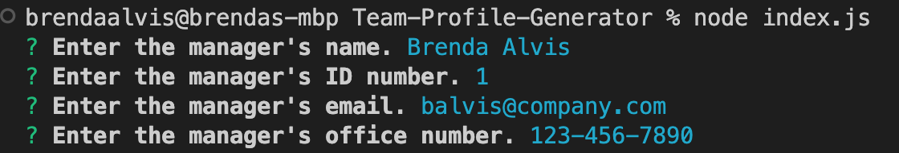
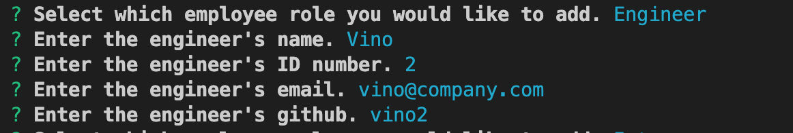
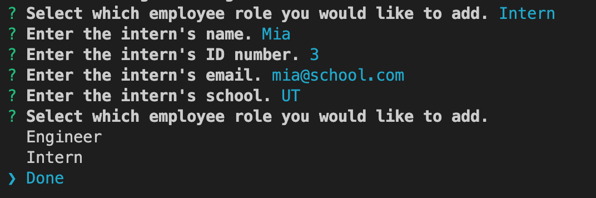
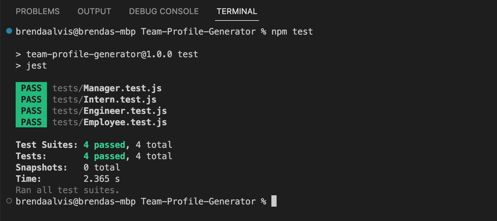

# Team-Profile-Generator
### Licenses

 ## Description
 
 This application is designed with the purpose of maximizing efficincy and organization. Users can quickly build a a team directory for easy access of pertinent team member information. The team information is displayed in a clean polished application. 
 
 ## How To

 [DEMO](https://drive.google.com/file/d/1LRUc6w_XEUEPEOBsxr-lzLB6NrNe0s04/view)

 To use this application, users should have node.js installed. Additionally, users should install the npm Inquirer package. This application generates the index.HTML from the terminal command-line. 

 * Step one: Open the terminal and type 'node index.js'.

* Step two: Enter the manager's information.

* Step three: Enter more team member information or end the application

* Step four: Generate the index.html

## Testing

 [Testing Video](https://drive.google.com/file/d/1XsxZMISqmA0QOZrIB2lnAxgmiilRQQQI/view)

 ## Credits & Resources
 I used many examples from the UT resources provided in class. My tutor Evan Hardek helped me with the promise logic.
